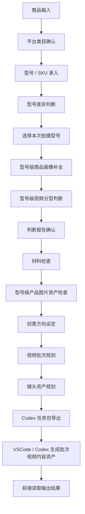

# 商品内容生产流程式工作台完整总设计

## 1. 文档定位

> 本章负责什么：确立本文档的权威性、维护顺序和其他文档的从属关系。

`00_design.md` 是本项目唯一权威总设计文档。本文档必须能够单独说明产品定位、业务对象、主流程、页面、规则、数据结构、输出规范和验收边界。

`docs/` 是从 `00_design.md` 拆分出来的阅读版，不是新的权威源；`codex_tasks/` 是从 `00_design.md` 拆分出来的执行指令目录。两者都不能覆盖或替代本文档中的业务定义。

`docs/rules/` 存放规则阅读版 Markdown，根目录 `rules/` 存放机器可读 JSON 规则；`docs/examples/` 存放案例阅读版；`docs/99_design_issues.md` 只记录设计问题，不是业务规则文档。以上内容均从属于 `00_design.md`。

如果 `00_design.md` 与 `docs/`、`codex_tasks/`、`00_MASTER_DESIGN.md` 或任何实现冲突，以 `00_design.md` 为准。任何新需求、新流程、新规则必须先修改 `00_design.md`，再同步 `docs/` 和 `codex_tasks/`。Codex 执行任何文档修改或实现任务前，必须先读取 `00_design.md`。

## 2. 项目定位

> 本章负责什么：说明系统解决的问题、目标用户、职责边界和最终产物。

项目名称：商品内容生产流程式工作台。

本系统不是普通的 AI 文案生成器，也不是单纯的类目判断工具。系统定位为：**面向 TikTok 电商商品短视频生产的流程式内容决策工作台**。

它把商品系列、型号 / SKU、商品判断、视频分型、材料、产品图片、创意方向、视频批次和镜头任务包串成一条有闸门的工作流。系统先解决“本次具体拍哪个型号、适合拍什么、缺什么、不能编造什么”，再把标准任务交给 VSCode / Codex 执行。

前端负责流程控制和结果展示，后端负责规则判断和文件生成，VSCode / Codex 负责内容资产生成。最终输出不是单独一篇脚本，而是一套可追踪到目标型号的判断报告、批次计划和镜头级任务包。

## 3. 核心原则

> 本章负责什么：定义所有设计、文档维护和实现都必须遵守的硬规则。

### 唯一权威源

`00_design.md` 是本项目唯一权威总设计文档（Single Source of Truth）。

- `docs/` 是从 `00_design.md` 拆分出来的阅读版。
- `codex_tasks/` 是从 `00_design.md` 拆分出来的执行指令目录。
- 如果 `00_design.md` 与 `docs/`、`codex_tasks/`、`00_MASTER_DESIGN.md` 或任何实现冲突，以 `00_design.md` 为准。
- 任何新需求、新流程、新规则必须先修改 `00_design.md`，再同步 `docs/` 和 `codex_tasks/`。
- Codex 执行任何文档修改或实现任务前，必须先读取 `00_design.md`。
- `00_MASTER_DESIGN.md` 已废弃，仅作为历史草稿保留，不参与后续同步、拆分和实现。

### 流程闸门

每一步都必须有通过条件。上一步没有完成，不能进入下一步。流程闸门用于阻止类目、型号、材料或图片未确认时继续生成低质量内容。

### 职责边界

- 前端是流程控制器，负责收集信息、展示判断、控制步骤和读取结果，不是自由聊天框。
- 后端是规则判断器和文件生成器，负责分类、分型、检查、报告和任务包，不是大模型服务。
- VSCode / Codex 是内容生成执行器，读取标准任务包并生成脚本、故事板、镜头卡和提示词。
- 执行器未来可以替换，但商品判断、SKU 约束和流程闸门不能被绕过。

## 4. 完整总流程

> 本章负责什么：定义系统当前唯一的默认主流程及各阶段顺序。



商品分类仍然是判断报告的必要规则输入，但作为型号级商品画像分析的一部分执行，不再增加一个主流程页面。

主流程的最小闭环是：确认一个可拍摄的目标型号，为该型号准备材料和图片，规划一批视频，并输出镜头级任务包。

## 5. 复杂度边界

> 本章负责什么：限制主流程只展开到型号 / SKU，并说明产品版本仅为可选扩展。

### 当前边界

当前系统只把业务对象展开到商品系列和型号 / SKU 层，不把组织、供应商、渠道、仓库、复杂版本树或素材知识图谱加入主流程。

```text
Product Series 商品系列
→ Variant / SKU 型号
→ Video Batch 视频批次
→ Shot Plan 镜头任务包
```

一个批次只能绑定一个本次拍摄型号。不同型号的图片、参数、配件和卖点默认不能混入同一个批次。

### 产品版本 / Revision 预留规则

产品版本不是默认必经流程。只有同一型号确实存在老款、新款或升级款差异时，才启用可选版本判断：

```text
Variant / SKU 型号
→ Optional Revision / Version 产品版本
```

仅在以下情况启用：

- 老款和新款结构不同。
- 老款和新款参数不同。
- 老款和新款图片不能混用。
- 需要制作新旧款对比视频。
- 需要判断旧素材是否还能继续使用。

默认情况下不创建版本对象、不增加版本确认页面、不把版本判断加入状态机主路径。

## 6. 商品 / 型号 / SKU 关系

> 本章负责什么：定义系列、型号、批次和镜头任务包的归属与隔离规则。

### 对象定义

- **Product Series 商品系列**：业务上的商品集合，例如“某品牌无线直发梳”。系列层保存平台类目、目标市场和共享定位。
- **Variant / SKU 型号**：可以被单独选择、拍摄和销售的具体型号。型号层保存外观、尺寸、参数、颜色、配件、图片和卖点差异。
- **Video Batch 视频批次**：针对一个目标型号的一组 3—5 条视频测试方案。
- **Shot Plan 镜头任务包**：批次内 A/B 级视频的镜头级执行资产。

### 型号差异判断

型号录入后至少比较：

```text
型号名称和 SKU 编码
外观结构与颜色
尺寸和重量
功能与参数
按钮、接口和显示区域
包装和配件
价格与主推卖点
产品图片是否可以共用
适合的视频分型是否相同
合规与安全信息是否相同
```

如果差异会影响画面、参数、卖点、配件或合规表达，必须分型号生产内容；不能把多个型号当成同一个产品随机混用。

### 目标型号选择规则

进入型号级画像前必须选择 `selected_variant_id`。之后的判断报告、材料检查、图片资产、创意方向、视频批次、镜头资产和 Codex 任务包都必须携带该标识。

如果商品只有一个型号，系统仍创建一个默认型号并自动选中，避免后续数据结构出现两套逻辑。

## 7. 页面结构

> 本章负责什么：定义前端页面、字段、交互、型号约束和页面通过条件。

### 型号 / SKU 录入页

页面收集型号名称、卖家 SKU、平台 SKU、颜色、尺寸、核心参数、配件、价格和型号图片。至少存在一个型号才能继续。

### 型号差异判断页

页面按外观、参数、功能、配件、图片、卖点和合规信息并排比较型号，输出哪些字段可共享、哪些必须隔离，以及是否需要分别制作视频。

### 本次拍摄型号选择页

用户必须选择本批次唯一的目标型号。选择后，后续页面顶部持续显示商品系列、目标型号和 SKU 编码；切换型号会使未确认的画像、报告、图片绑定、批次和镜头规划失效并要求重新检查。

### 型号级页面约束

旧文档中的“商品画像补全页”在当前设计中等同于“型号级商品画像补全页”；“判断报告页”等同于“型号级判断报告页”；“产品图片资产页”等同于“型号级产品图片资产页”。“材料检查页”保持原名，但仍按当前 `selected_variant_id` 工作。系列级共享信息可以继承，但型号级参数和图片不得被其他型号覆盖。

### 页面结构

系统页面包括：

```text
商品库
├── 商品列表页
├── 新建商品页
├── 类目确认页
├── 型号 / SKU 录入页
├── 型号差异判断页
├── 本次拍摄型号选择页
├── 型号级商品画像补全页
├── 型号级判断报告页
├── 材料检查页
├── 型号级产品图片资产页
├── 创意方向设定页
├── 型号级视频批次规划页
├── 镜头资产规划页
├── Codex 任务包导出页
└── 输出结果查看页

规则库
├── 平台类目规则
├── 商品分类规则
├── 视频分型规则
├── 类目打法规则
├── 创意翻译规则
├── 视频批次规划规则
├── 镜头规划规则
├── 图片资产规则
└── 材料检查规则

本地文件
├── products
├── reports
├── image_assets
├── creative_boards
├── video_batches
├── shot_plans
├── tasks
└── outputs
```

---

### 商品列表页

#### 页面目标

展示所有已创建商品，以及每个商品当前卡在哪一步。

#### 页面字段

列表字段：

- 商品名称
- 目标平台
- 目标市场
- 平台类目
- 商品分类
- 当前状态
- 缺失材料数量
- 最近更新时间
- 操作按钮

#### 操作按钮

```text
继续处理
查看报告
查看任务包
查看输出结果
删除商品
```

#### 页面示例

```text
商品名称        平台            类目                       分类        状态              操作
车载吸尘器      TikTok US       Automotive & Motorcycle    小件标品    材料检查中        继续处理
无线直发梳      TikTok US       Beauty & Personal Care     小件标品    判断报告已确认    继续处理
宠物玩具        TikTok US       Pet Supplies               小件标品    类目已确认        继续处理
```

---

### 新建商品页

#### 页面目标

建立商品对象。

#### 必填字段

```text
产品名称
目标平台
目标市场
当前业务阶段
```

#### 选填字段

```text
商品图片
1688 链接
TikTok 竞品链接
Amazon 竞品链接
供应商资料
价格区间
采购数量
备注
```

#### 当前业务阶段

```text
选品验证
已采购样品
准备拍视频
准备上架
已上架待优化
```

#### 通过条件

```text
产品名称不能为空
目标平台必须选择
目标市场必须选择
当前业务阶段必须选择
```

#### 输出数据

商品基础信息 JSON 结构统一维护在 [数据结构阅读版](docs/05_data_structures.md#商品基础信息数据结构)。

### 类目确认页

#### 页面目标

识别并确认商品的平台类目。

平台类目必须人工确认。

不能让 AI 直接猜完就往后走。

#### 系统展示内容

```text
产品名称
候选一级类目
候选二级类目
置信度
推荐理由
风险提示
```

#### 示例

产品：车载吸尘器

```text
候选类目 1：Automotive & Motorcycle
置信度：88%
理由：主要使用场景是车内清洁，属于汽车用品场景。

候选类目 2：Household Appliances
置信度：54%
理由：商品具备小家电属性，但主要使用场景不是家庭清洁。

候选类目 3：Tools & Hardware
置信度：31%
理由：有工具属性，但不是维修工具类商品。
```

#### 用户动作

```text
确认推荐类目
手动修改类目
返回修改商品名称
```

#### 通过条件

```text
platform_category 已确认
必要时 sub_category 已确认
用户点击确认
```

#### 输出数据

类目确认 JSON 结构统一维护在 [数据结构阅读版](docs/05_data_structures.md#类目确认数据结构)。

### 型号级商品画像补全页

#### 页面目标

补齐影响内容判断和视频生产的商品特征。

这里必须做成选择题，不要让运营自由乱写。

#### 基础画像字段

```text
商品体积：
- 小件，可手持
- 中件，桌面展示
- 大件，需要房间/户外空间

是否需要真人出镜：
- 不需要
- 最好需要
- 必须需要

是否需要大场景：
- 不需要
- 需要简单场景
- 需要完整家居/户外/车内场景

是否有明确功能：
- 是，功能很明确
- 一般，需要解释
- 否，主要靠款式/颜值/情绪价值

是否强依赖审美、款式或效果：
- 是
- 否

是否适合对比测试：
- 是
- 否

是否有包装展示价值：
- 是
- 否
```

#### 风险画像字段

```text
是否电子/电器类
是否含电池
是否接触人体
是否儿童相关
是否宠物相关
是否食品/饮品
是否高单价
是否有认证或合规要求
```

#### 卖点字段

```text
主要卖点类型：
- 功能效果
- 便携
- 外观颜值
- 价格优势
- 材质品质
- 使用场景
- 痛点解决
- 情绪价值
- 安全性
- 省时间
- 省空间
```

#### 冲突检查

系统必须检查明显冲突。

示例：

```text
产品：无线直发梳
用户填写：不需要真人出镜
系统提醒：该商品属于美妆个护类，并且效果依赖头发前后对比，建议将真人出镜调整为“最好需要”或“必须需要”。
```

```text
产品：沙发
用户填写：小件，可手持
系统提醒：Furniture 类目通常属于大件标品，请重新确认体积。
```

#### 通过条件

```text
基础画像字段全部完成
风险画像字段全部完成
卖点类型至少选择 1 个
不存在严重冲突
如存在轻微冲突，用户必须确认继续
```

#### 输出数据

商品画像 JSON 结构统一维护在 [数据结构阅读版](docs/05_data_structures.md#商品画像数据结构)。

### 型号级判断报告页

#### 页面目标

把类目判断、商品分类、内容难度、视频分型、类目打法、风险和缺失信息整合成一份报告。

这份报告是后续脚本、分镜、提示词生成的内容决策底稿。

#### 报告结构

```text
顶部结论卡
内容难度评分
视频分型推荐
推荐拍法排序
类目打法建议
风险提醒
缺失信息
下一步动作
```

#### 顶部结论卡

示例：

```text
产品名称：车载吸尘器
目标平台：TikTok Shop US
目标市场：美国
平台类目：Automotive & Motorcycle
商品分类：小件标品
自制视频推荐：高
综合结论：适合低成本自制短视频启动，但必须解决同质化和信任感问题。
```

#### 内容难度评分

```text
拍摄容易度：★★★★★
种草容易度：★★★★☆
消费决策容易度：★★★☆☆
```

#### 视频分型推荐

```text
生活场景型：★★★★★
卖点讲解型：★★★★☆
测评对比型：★★★★☆
开箱直拍型：★★★☆☆
买家卖家秀型：★★★☆☆
```

#### 推荐拍法排序

```text
第一推荐：生活场景型
理由：车载吸尘器必须放进车内座椅缝隙、脚垫、杯架、后备箱等真实场景，用户才知道它解决什么问题。

第二推荐：卖点讲解型
理由：吸力、续航、噪音、尘盒容量、配件、清理方式需要被明确讲出来。

第三推荐：测评对比型
理由：同类商品多，用户会比较清洁效果，用对比测试更容易建立信任。
```

#### 类目打法建议

```text
开头钩子：
- 车里这些缝隙脏到你想不到
- 别再用纸巾擦车缝了
- 这个小东西专门清理车里最难搞的地方

必须展示：
- 座椅缝隙清洁
- 脚垫灰尘清洁
- 吸力近景
- 尘盒清理
- 配件展示

信任补强：
- 展示真实灰尘
- 展示吸入过程
- 展示清洁前后对比
- 展示噪音和续航信息
```

#### 风险提醒

```text
内容风险：
- 同类视频容易撞创意
- 单纯展示产品外观没有意义
- 不展示真实清洁效果，用户不会信

商品风险：
- 电子电器类商品可能需要合规资料
- 需要确认电池、充电、认证、安全标识
```

#### 缺失信息

```text
吸力参数
续航时间
噪音数值
电池容量
尘盒容量
滤芯是否可清洗
认证资料
产品实拍图
真实车内使用素材
```

#### 通过条件

```text
报告已生成
用户已阅读风险提醒
用户点击确认报告
如有严重缺失信息，必须进入材料检查页处理
```

---

### 材料检查页

#### 页面目标

在生成脚本、分镜、提示词之前，检查材料是否够用。

#### 材料分类

```text
商品基础材料
内容生产材料
创意表达材料
产品图片资产
视频素材材料
合规与限制材料
竞品参考材料
```

#### 页面规则与通过条件

材料分组、检查等级、示例和通过条件统一维护在 [材料检查规则阅读版](docs/rules/04_material_check_rules.md)。页面按规则结果展示必须、建议、风险和缺失项，并控制流程闸门。

### 型号级产品图片资产页

#### 页面目标

检查产品原始图片是否足够支撑 AI 视频生成，并把每张图片标记成可被后续镜头级提示词调用的资产。

产品图片不是普通附件，而是控制 AI 视频不失真的核心输入。

如果产品原始图不足，系统不能直接进入高质量 Seedance / 即梦镜头提示词生成，只能生成脚本、拍摄方案和缺图清单。

#### 图片资产分类

```text
product_reference        产品外观锁定图
product_detail           产品细节图
usage_scene              使用场景图
before_after             前后对比图
packaging                包装图
style_reference          风格参考图
motion_reference         运镜/动作参考视频
```

#### 页面规则与通过条件

图片最低要求、完整度、资产字段、镜头绑定和通过条件统一维护在 [产品图片资产规则阅读版](docs/rules/05_image_asset_rules.md)。页面负责上传、标注、缺图提示和能力降级提示。

### 创意方向设定页

#### 页面目标

让用户输入自己的创意意图，并由系统把普通人的创意语言翻译成专业的镜头语言、画面质感、节奏和素材需求。

普通用户不需要懂运镜、灯光、镜头语言。

用户只需要表达：

```text
想要什么风格
想要什么剧情
想突出什么卖点
希望用户看完记住什么
哪些内容不能出现
```

系统负责把这些转成：

```text
推荐运镜
推荐画面质感
推荐镜头节奏
推荐光线
推荐参考素材
镜头级 Seedance 提示词要求
```

#### 用户可选择字段

创意风格：

```text
搞笑反转
夸张戏剧化
好莱坞电影感
真实生活记录感
测评实验感
解压爽感
高级质感广告
原生 TikTok 口播
无厘头短剧
前后对比冲击
```

剧情结构：

```text
痛点夸张化
误会反转
前后对比
小剧场冲突
产品英雄登场
用户被惊艳
失败方法 vs 正确方法
普通工具 vs 本产品
```

表达强度：

```text
保守真实
中等夸张
强戏剧化
```

真人限制：

```text
不允许真人
只允许手部
允许真人但不露脸
允许真人露脸
```

重点突出卖点：

```text
功能效果
便携
价格优势
外观质感
清洁效率
使用前后对比
省时间
省空间
安全性
```

#### 自由创意输入

用户可以补充自己的想法。

示例：

```text
我想要一个搞笑短剧，车主打开车门后发现座椅缝隙像灾难现场，普通纸巾和毛刷都失败，最后车载吸尘器像英雄一样登场，把缝隙清理干净。
```

#### 通过条件

```text
至少选择 1 个创意风格
至少选择 1 个剧情结构
已选择表达强度
已选择真人限制
已确认创意优先级
系统已生成专业镜头语言翻译
用户已确认创意方向
```

---

创意翻译、优先级和禁止事项统一维护在 [创意翻译规则阅读版](docs/rules/06_creative_translation_rules.md)。

### 型号级视频批次规划页

#### 页面目标

一个目标型号通常不应该只生成一条视频。

这个页面的目标是：围绕当前选中的目标型号，一次规划一组用于测试的短视频方案。

系统不是简单生成 5 条相似视频，而是帮助用户规划：

```text
本次要生成几条视频
每条视频测试什么内容角度
每条视频属于什么视频分型
每条视频主推哪个卖点
每条视频使用什么创意风格
每条视频生成到什么深度
哪些视频进入 Seedance 镜头级提示词
哪些视频只做草案
```

#### 批次目标

用户需要选择本次批次目标。

```text
测试不同视频分型
测试不同开头钩子
测试不同卖点
测试不同使用场景
测试不同创意风格
测试不同用户痛点
```

#### 每条视频配置字段

每条视频至少需要配置：

```text
video_id
视频分型
创意风格
主卖点
使用场景
目标用户痛点
生成等级
是否生成 Seedance 镜头级提示词
是否需要真人素材
是否需要产品原图锁定
是否需要竞品对比素材
预计镜头数量
预计时长
```

#### 页面展示示例

产品：车载吸尘器

```text
本次批次：batch_001
批次目标：测试车载吸尘器不同内容角度
视频数量：3 条
默认策略：1A_1B_1C

video_01：生活场景型
主卖点：座椅缝隙清洁
创意风格：真实痛点
生成等级：A
生成 Seedance 镜头提示词：是

video_02：卖点讲解型
主卖点：吸力和便携
创意风格：强卖点讲解
生成等级：B
生成 Seedance 镜头提示词：是

video_03：测评对比型
主卖点：普通纸巾清不掉，本产品能清
创意风格：对比测试
生成等级：C
生成 Seedance 镜头提示词：否
```

素材充足时，可以继续扩展 `video_04` 和 `video_05`，并采用 `2A_2B_1C`。

#### 通过条件

```text
已确认批次 ID
已确认本次生成视频数量
每条视频已选择视频分型
每条视频已填写主卖点
每条视频已填写创意风格
每条视频已选择生成等级
系统已检查图片素材是否支撑对应生成等级
系统已限制不满足条件的视频进入 A 级完整生成
用户已确认本批次规划
```

---

批次生成等级、数量限制和结构化输出统一维护在 [视频批次规划规则阅读版](docs/rules/07_video_batch_rules.md)。

### 镜头资产规划页

#### 页面目标

把视频批次中的每条视频拆成可执行的镜头级资产。

本页面不是只服务一条视频，而是服务一个视频批次。

系统需要对每条进入 A 级或 B 级生成的视频分别生成镜头资产；C 级轻量草案不强制生成完整镜头卡。

#### 四个概念的区别

```text
画板 Creative Board：一条视频一个，说明整体创意、卖点、风格、参考素材和禁区
故事板 Storyboard：一条视频一个，说明镜头顺序、时长、画面、字幕和节奏
镜头卡 Shot Card：每个镜头一个，说明该镜头的执行要求
Seedance Prompt：每个镜头一个，作为喂给视频模型的具体提示词
```

如果一条视频拆成 10 个镜头，不是 10 个画板，而是：

```text
1 个 Creative Board
1 个 Storyboard
10 个 Shot Cards
10 个 Seedance Prompts
```

#### 镜头资产规划示例

视频：车内灾难现场救援

```text
总时长：20 秒
视频分型：生活场景型 + 搞笑反转
创意风格：好莱坞灾难片感
产品目标：突出车内缝隙清洁能力

Shot 01：灾难开场
时长：3 秒
目标：放大痛点
画面：车主打开车门，镜头快速推入座椅缝隙，灰尘和碎屑像灾难现场。
产品是否出现：否
运镜：快速 push in + 微距特写
字幕：Your car seat gap is hiding a disaster.

Shot 02：普通方法失败
时长：4 秒
目标：制造搞笑失败
画面：手拿纸巾尝试擦缝隙，但越擦越乱。
产品是否出现：否
运镜：手持跟拍 + 快速切换
字幕：Tissue? Nope.

Shot 03：产品英雄登场
时长：3 秒
目标：让产品登场有记忆点
画面：车载吸尘器从暗处出现，带一点英雄光效。
产品是否出现：是
运镜：低角度 hero shot + 慢推
字幕：Send in the tiny cleaner.

Shot 04：清洁效果
时长：6 秒
目标：证明功能
画面：吸头进入缝隙，碎屑被吸走，尘盒里能看到灰尘。
产品是否出现：是
运镜：微距跟拍 + 横移 tracking
字幕：Gets into the spots your hand can’t.

Shot 05：前后对比
时长：4 秒
目标：收束购买理由
画面：清洁前后左右分屏对比。
产品是否出现：是
运镜：固定镜头 + 快切
字幕：Before vs After.
```

#### 通过条件

```text
批次内每条 A 级视频已生成 1 个 Creative Board
批次内每条 A 级视频已生成 1 个 Storyboard
批次内每条 A 级视频的每个镜头已生成 Shot Card
批次内每条 A 级视频的每个镜头已绑定输入图片或标记不需要图片
批次内每条 A 级视频的每个镜头已生成 Seedance Prompt 草案
批次内每条 B 级视频已生成简版 Storyboard 和主要镜头说明
批次内每条 C 级视频已生成轻量草案
每个镜头已标记产品失真风险
每个镜头已确认服务哪个卖点或剧情目标
```

---

镜头数量、镜头卡和提示词字段统一维护在 [镜头资产规划规则阅读版](docs/rules/08_shot_planning_rules.md)。

### Codex 任务包导出页

#### 页面目标

把前面所有判断结果和材料整理成标准任务包，交给 VSCode / Codex 使用。

前端不直接调用 Codex 插件。

前端只生成任务文件。

#### 导出文件

```text
data/products/p_001_product.json
data/reports/p_001_judgement_report.md
data/image_assets/p_001_image_assets.json
data/creative_boards/p_001_creative_board.md
data/video_batches/p_001_batch_001_video_batch_plan.json
data/shot_plans/p_001_batch_001_shot_plan.json
data/tasks/p_001_sku_001_batch_001_codex_task.md
data/tasks/p_001_sku_001_batch_001_codex_task.json
```

#### 任务包模板与输出规范

完整模板、输出目录、质量要求和 VSCode / Codex 衔接方式统一维护在 [Codex 任务包阅读版](docs/06_codex_task_package.md)。

### 输出结果查看页

#### 页面目标

读取 Codex 生成的 outputs 文件，并展示脚本、分镜、提示词、拍摄清单。

#### 读取目录

```text
outputs/{product_series_id}/{batch_id}/batch_summary.md
outputs/{product_series_id}/{batch_id}/video_01/
outputs/{product_series_id}/{batch_id}/video_02/
outputs/{product_series_id}/{batch_id}/video_03/
```

只有素材充足并通过批次检查时，结果页才读取 `video_04/` 和 `video_05/`。

#### 页面展示

```text
创意画板
脚本结果
故事板
镜头卡
Seedance / 即梦镜头级提示词
图片输入计划
剪辑合成计划
质检清单
缺失素材提醒
```

#### 操作

```text
查看文件
复制内容
标记通过
标记需要重做
重新导出 Codex 任务包
```

---

## 8. 状态机

> 本章负责什么：定义商品系列进入型号级内容生产后的流程状态。

### 状态枚举

```text
draft                          草稿
basic_info_completed           商品系列基础信息已完成
category_detected              平台类目已识别
category_confirmed             平台类目已确认
variants_recorded              型号 / SKU 已录入
variant_differences_checked    型号差异已判断
target_variant_selected        本次拍摄型号已选择
variant_profile_completed      型号级商品画像已补全
video_type_completed           型号级视频分型已完成
report_generated               判断报告已生成
report_confirmed               判断报告已确认
materials_checked              材料已检查
variant_image_assets_checked   型号级产品图片资产已检查
creative_direction_confirmed   创意方向已确认
video_batch_planned            视频批次已规划
shot_assets_planned            镜头资产已规划
task_package_exported          Codex 任务包已导出
codex_processing               Codex 处理中
codex_output_ready             Codex 输出已生成
completed                      完成
blocked                        被阻断
```

商品分类结论保存在型号级判断报告中，不单独增加主流程状态。可选产品版本启用时只作为目标型号内部校验，不改变默认状态机。

## 9. 页面进入条件

> 本章负责什么：定义流程闸门以及切换目标型号后的失效规则。

```text
商品系列基础信息未完成：不能进入平台类目确认
平台类目未确认：不能录入并确认型号业务信息
型号 / SKU 未录入：不能进行型号差异判断
型号差异未判断：不能选择本次拍摄型号
本次拍摄型号未选择：不能补全型号级商品画像
型号级商品画像未完成：不能生成视频分型和判断报告
判断报告未确认：不能进入材料检查
材料检查未通过：不能进入型号级产品图片资产检查
目标型号图片资产未检查：不能进入创意方向设定
创意方向未确认：不能进入视频批次规划
视频批次未规划：不能进入镜头资产规划
镜头资产未规划：不能导出 Codex 任务包
任务包未导出：不能进入 Codex 输出结果页
```

切换 `selected_variant_id` 后，系统必须重新验证所有型号级步骤。只有明确标记为系列共享的材料可以继续沿用。

## 10. 商品分类规则

> 本章负责什么：定义对目标型号执行的小件标品、非标品和大件标品判断。

### 型号级适用范围

商品分类针对当前 `selected_variant_id` 执行。同一商品系列的不同型号如果尺寸、结构或拍摄依赖不同，可以得到不同分类结论。

### 商品分类规则

商品分类分为三类：

```text
小件标品
非标品
大件标品
```

#### 小件标品

覆盖类目：

```text
Phones & Electronics
Beauty & Personal Care
Automotive & Motorcycle
Fashion Accessories
Tools & Hardware
Home Supplies
Household Appliances
Luggage & Bags
Home Improvement
Toys & Hobbies
Pet Supplies
Computers & Office Equipment
```

评分：

```text
拍摄容易度：5
种草容易度：4
消费决策容易度：3
```

特征：

```text
拍摄成本低
场景相对简单
不需要太大空间
通常不需要外模真人出镜
商品体积较小，便于操作和展示
功能特点明确，容易提炼核心卖点
价格相对较低，消费者决策压力较小
```

风险：

```text
同类商品多
竞争集中
需要差异化卖点
低价商品容易被质疑质量
需要通过视频建立信任
```

#### 非标品

覆盖类目：

```text
Womenswear & Underwear
Jewelry Accessories & Derivatives
Menswear & Underwear
Shoes
Food & Beverages
```

评分：

```text
拍摄容易度：3
种草容易度：4
消费决策容易度：4
```

特征：

```text
款式、风格、设计差异明显
适合通过真人、场景、故事做种草
情绪价值强
消费者不只看价格，也看风格和自我匹配度
```

风险：

```text
拍摄成本较高
需要本地化场景
可能需要外模或真人出镜
颜色、材质、细节呈现要求高
消费者主观偏好差异大
需要精细化人群定位
```

#### 大件标品

覆盖类目：

```text
Sports & Outdoor
Furniture
Kitchenware
Textiles & Soft Furnishings
```

评分：

```text
拍摄容易度：2
种草容易度：4
消费决策容易度：3
```

特征：

```text
消费者痛点明确
使用场景明确
适合展示规格、材质、功能
短视频能帮助用户理解产品价值
```

风险：

```text
需要较大拍摄空间
可能需要专业设备
单价较高，决策成本高
用户更关注性价比
用户可能担心售后、安装、运输、维修
```

---

## 11. 视频分型规则

> 本章负责什么：定义目标型号的视频分型推荐、类目打法、修正和限制规则。

### 型号级适用范围

视频分型针对当前 `selected_variant_id` 推荐，不得只依据商品系列名称覆盖所有型号。

### 视频分型规则

视频分型分为五类：

```text
生活场景型
卖点讲解型
开箱直拍型
买家卖家秀型
测评对比型
```

视频分型规则只决定推荐优先级，不直接决定生成数量。生成几条视频由型号级视频批次规划页决定。

#### 生活场景型

英文：Life scenarios connected

内容定义：

```text
通过将商品与具体生活场景结合，让观众直观看到商品在实际生活中的用途和价值。
```

视频要求：

```text
重点刻画商品应该出现的真实生活场景
商品介绍依赖字幕、配音或画面展示，不依赖出镜者直接讲解
同一生活场景下商品不同视角至少出现 2 次以上
或同一商品出现在不同使用场景至少 2 次以上
```

适合商品：

```text
汽车用品
家居用品
宠物用品
户外用品
厨房用品
日用家电
清洁工具
```

#### 卖点讲解型

英文：Selling points presentation

内容定义：

```text
围绕用户痛点、商品功能、独特优势、价格优势、优惠信息等核心卖点展开拍摄。
```

视频要求：

```text
商品作为视频主体
商品出现时长和画面占比高
视频大部分时间都在输出商品卖点信息
画面、声音或字幕至少说明 2 种以上围绕商品的干货信息
干货信息包括：痛点解决、功能讲解、使用方式、细节演示、价格优势、限时优惠等
```

适合商品：

```text
功能明确的小件标品
3C 电子
工具五金
车载用品
小家电
美容个护电器
```

#### 开箱直拍型

英文：Unboxing

内容定义：

```text
从打开包装、拆快递、商品全貌、商品细节特写开始，直接围绕商品拍摄，展示所见即所得。
```

视频要求：

```text
商品作为视频主体
商品细节清晰展示
包含打开包装、商品全貌展示、商品细节展示全过程
配合音乐、字幕或解说说明开箱商品信息和直观感受
```

适合商品：

```text
有包装价值的商品
礼盒类商品
配件丰富的商品
外观精致的商品
新品展示
```

注意：

```text
开箱直拍通常适合作为辅助内容，不应该默认作为主力内容。
如果商品核心价值来自使用效果，单纯开箱价值很低。
```

#### 买家卖家秀型

英文：Buyer or Seller Show

内容定义：

```text
真人实测、上身、上手、使用或演示商品，讲解实际使用感受和细节功能。
```

视频要求：

```text
人物或身体部位作为视频主体
视频中有真人或身体部位出镜
人物大部分时间在描述、使用、测评商品
有详细商品介绍、功能介绍或真实体验
```

适合商品：

```text
服饰
鞋子
珠宝配饰
美妆个护
发型工具
需要真人效果展示的商品
需要尺寸参考的商品
```

#### 测评对比型

英文：Evaluation and comparison type

内容定义：

```text
通过同类商品测评对比突出商品优势，并给观众专业建议和清晰购买引导。
```

视频要求：

```text
除了挂链商品外，出现 1 个以上同类产品进行对比测评
或同一商品出现 1 个以上不同口味、款式、规格进行对比测评
对比要客观展示优缺点，不能明显偏袒
```

适合商品：

```text
同质化严重的商品
功能可测试的商品
参数可对比的商品
用户购买前会横向比较的商品
```

---

### 一级类目与视频分型推荐规则

分数含义：

```text
0：不推荐
1：弱推荐
2：推荐
3：强推荐
```

#### 规则表

| 一级类目 | 商品分类 | 生活场景型 | 卖点讲解型 | 开箱直拍型 | 买家卖家秀型 | 测评对比型 |
|---|---|---:|---:|---:|---:|---:|
| Phones & Electronics | 小件标品 | 2 | 3 | 2 | 2 | 0 |
| Beauty & Personal Care | 小件标品 | 2 | 0 | 0 | 3 | 0 |
| Automotive & Motorcycle | 小件标品 | 3 | 2 | 0 | 2 | 2 |
| Fashion Accessories | 小件标品 | 3 | 3 | 2 | 2 | 0 |
| Tools & Hardware | 小件标品 | 3 | 2 | 2 | 2 | 0 |
| Home Supplies | 小件标品 | 3 | 2 | 0 | 2 | 0 |
| Household Appliances | 小件标品 | 3 | 0 | 0 | 3 | 0 |
| Luggage & Bags | 小件标品 | 3 | 2 | 2 | 0 | 0 |
| Home Improvement | 小件标品 | 3 | 0 | 2 | 3 | 0 |
| Toys & Hobbies | 小件标品 | 2 | 3 | 2 | 3 | 0 |
| Pet Supplies | 小件标品 | 3 | 0 | 2 | 0 | 0 |
| Computers & Office Equipment | 小件标品 | 3 | 2 | 0 | 2 | 0 |
| Womenswear & Underwear | 非标品 | 0 | 2 | 0 | 3 | 0 |
| Jewelry Accessories & Derivatives | 非标品 | 0 | 3 | 0 | 0 | 0 |
| Menswear & Underwear | 非标品 | 2 | 0 | 0 | 3 | 2 |
| Shoes | 非标品 | 0 | 3 | 0 | 3 | 0 |
| Food & Beverages | 非标品 | 0 | 0 | 0 | 3 | 3 |
| Sports & Outdoor | 大件标品 | 2 | 2 | 0 | 3 | 0 |
| Furniture | 大件标品 | 3 | 0 | 0 | 3 | 0 |
| Kitchenware | 大件标品 | 3 | 2 | 0 | 3 | 0 |
| Textiles & Soft Furnishings | 大件标品 | 2 | 0 | 2 | 3 | 0 |

#### 分型修正规则

基础分来自一级类目。

再根据商品画像做修正：

```text
requires_model = true：买家卖家秀型 +1
has_clear_function = true：卖点讲解型 +1
requires_large_scene = true：生活场景型 +1
suitable_for_comparison = true：测评对比型 +1
style_sensitive = true：买家卖家秀型 +1，生活场景型 +1
product_has_packaging = true：开箱直拍型 +1
is_high_price = true：测评对比型 +1，卖点讲解型 +1
is_electronic = true：卖点讲解型 +1，测评对比型 +1
```

限制规则：

```text
开箱直拍型不得因为包装存在而自动成为最高优先级
没有真人素材时，买家卖家秀型不能进入可执行状态，只能标记为推荐但材料缺失
没有同类竞品或对比对象时，测评对比型不能进入可执行状态，只能标记为推荐但材料缺失
没有真实使用场景素材时，生活场景型可以执行，但必须生成场景拍摄清单
```

---

### 类目打法库

### 类目打法库

#### 3C 电子类

覆盖类目：

```text
Phones & Electronics
Computers & Office Equipment
```

内容重点：

```text
强功能
强演示
强便利性
多角度展示
```

开头方式：

```text
用大胆声明制造好奇
强调以前很麻烦，现在很简单
强调第一次看到会震惊
```

必须展示：

```text
功能如何使用
使用前后有什么变化
每个卖点都要有实物演示
多角度展示商品细节
```

适合分型：

```text
卖点讲解型
开箱直拍型
测评对比型
```

#### 日用家纺 / 家电 / 家具类

覆盖类目：

```text
Home Improvement
Home Supplies
Furniture
Household Appliances
Kitchenware
Textiles & Soft Furnishings
```

内容重点：

```text
真实生活场景
使用价值
材质规格
使用效果
```

开头方式：

```text
用强判断句表达对商品的信心
直接指出使用痛点
把商品放进具体家庭场景
```

必须展示：

```text
使用场合
使用效果
材质
容量
尺寸
功能
真实评价或真实体验
不同角度和不同场景
```

适合分型：

```text
生活场景型
卖点讲解型
买家卖家秀型
```

#### 运动器械 / 户外类

覆盖类目：

```text
Sports & Outdoor
```

内容重点：

```text
安装过程
功能完整演示
使用效果
稳定性
安全性
便携性
```

开头方式：

```text
直接展示运动或户外场景
先给结果，再讲产品
用这个东西解决了什么不方便切入
```

必须展示：

```text
安装过程
使用过程
功能细节
使用前后体验差异
稳定性、安全性、便携性
```

适合分型：

```text
生活场景型
卖点讲解型
买家卖家秀型
```

#### 服饰 / 鞋 / 珠宝 / 配饰 / 箱包类

覆盖类目：

```text
Womenswear & Underwear
Menswear & Underwear
Shoes
Jewelry Accessories & Derivatives
Fashion Accessories
Luggage & Bags
```

内容重点：

```text
真人展示
尺码信息
多角度细节
场景搭配
风格表达
```

开头方式：

```text
我在 TikTok Shop 找到一个……
这个包/衣服/鞋真的很适合……
职场/通勤/约会/秋季必备……
```

必须展示：

```text
近景细节
远景整体效果
上身/上脚/上手效果
尺码参考
材质、手感、弹性
使用季节或使用场景
促销价格
```

适合分型：

```text
买家卖家秀型
生活场景型
开箱直拍型
```

#### 美妆个护类

覆盖类目：

```text
Beauty & Personal Care
```

内容重点：

```text
真人效果
步骤演示
前后对比
效果持续时间
```

开头方式：

```text
这是我收到最多好评的……
我来告诉你这个效果怎么做
不用花太长时间，也能……
```

必须展示：

```text
真人使用
使用步骤
前后对比
效果维持时间
使用体验
安全性
防烫
便携
适合人群
```

适合分型：

```text
买家卖家秀型
卖点讲解型
测评对比型
```

#### 食品 / 日用品 / 宠物类

覆盖类目：

```text
Pet Supplies
Food & Beverages
```

内容重点：

```text
数量感
过程感
真实使用对象
真实反应
```

食品类必须展示：

```text
包装数量
口味/种类
装箱过程
真实食用反应
```

宠物类必须展示：

```text
宠物真实互动
使用前后
安全材质
耐咬/耐用/清洁便利
```

适合分型：

```text
生活场景型
开箱直拍型
买家卖家秀型
```

---

## 12. 材料检查规则

> 本章负责什么：定义进入内容生产前必须、建议和风险材料的检查方式。

### 材料检查页

#### 页面目标

在生成脚本、分镜、提示词之前，检查材料是否够用。

#### 材料分类

```text
商品基础材料
内容生产材料
创意表达材料
产品图片资产
视频素材材料
合规与限制材料
竞品参考材料
```

#### 商品基础材料

```text
产品名称
目标平台
目标市场
平台类目
商品分类
核心卖点
价格区间
产品参数
```

#### 内容生产材料

```text
目标用户
用户痛点
使用场景
主推卖点
视频分型
内容风格
禁用表达
```

#### 视频素材材料

```text
产品图片
产品实拍图
使用场景图
真人素材
宠物素材
竞品视频
包装图
细节图
```

#### 合规与限制材料

```text
认证资料
电池信息
安全警示
平台限制
不能夸大的功效
不能编造的参数
```

#### 检查等级

```text
必须材料：缺失则不能继续
建议材料：缺失时提醒，但用户确认后可继续
风险材料：缺失时必须在任务包里写明不能编造
```

#### 车载吸尘器材料检查示例

必须材料：

```text
产品名称
目标平台
目标市场
平台类目
商品分类
核心卖点
使用场景
视频分型
```

建议材料：

```text
产品图片
吸力参数
续航时间
噪音数值
尘盒容量
配件图
真实车内使用素材
竞品视频
```

风险材料：

```text
认证资料
电池容量
充电规格
安全标识
```

#### 通过条件

```text
必须材料齐全
建议材料缺失但用户已确认
风险材料缺失时，系统已写入禁止编造规则
```

---

## 13. 产品图片资产规则

> 本章负责什么：定义目标型号的图片要求、完整度、绑定原则和降级条件。

### 型号级产品图片资产页

#### 页面目标

检查产品原始图片是否足够支撑 AI 视频生成，并把每张图片标记成可被后续镜头级提示词调用的资产。

产品图片不是普通附件，而是控制 AI 视频不失真的核心输入。

如果产品原始图不足，系统不能直接进入高质量 Seedance / 即梦镜头提示词生成，只能生成脚本、拍摄方案和缺图清单。

#### 图片资产分类

```text
product_reference        产品外观锁定图
product_detail           产品细节图
usage_scene              使用场景图
before_after             前后对比图
packaging                包装图
style_reference          风格参考图
motion_reference         运镜/动作参考视频
```

#### 产品外观锁定图最低要求

普通商品至少需要：

```text
产品正面图
产品侧面图
产品背面图
产品 45 度角图
产品尺寸比例参考图
产品细节图
配件图
包装图
```

电器类商品额外需要：

```text
按钮区域特写
充电口特写
显示屏/指示灯特写
接口/插头特写
标签铭牌图
安全标识图
配件组合图
```

使用效果类商品额外需要：

```text
使用前图
使用中图
使用后图
真实场景图
真人/手部/宠物互动图
```

#### 车载吸尘器图片要求示例

```text
产品正面
产品侧面
产品背面
产品 45 度角
吸头/刷头
尘盒
滤芯
充电口
配件全家福
握持图
车内使用图
座椅缝隙使用图
脚垫使用图
清洁前后对比图
包装图
铭牌/参数标签图
```

#### 图片完整度等级

```text
图片少于 3 张：禁止生成 Seedance 镜头提示词，只能生成脚本和补图清单
图片 3-5 张：允许生成基础提示词，但标记高失真风险
图片 6-8 张：允许生成标准镜头提示词，但需要提示缺失角度
图片 8 张以上且覆盖多角度、细节、场景：允许生成高质量镜头级提示词
```

#### 图片资产数据结构

```json
{
  "image_id": "img_001",
  "file_name": "product_front.png",
  "image_type": "product_reference",
  "view_angle": "front",
  "usage": [
    "lock_product_shape",
    "hero_shot",
    "selling_point_demo"
  ],
  "quality": "high",
  "required": true,
  "notes": "用于锁定产品正面外观，不允许改变颜色和结构。"
}
```

#### 镜头图片绑定原则

每个镜头都必须明确：

```text
使用哪些图片
这些图片分别干什么
哪些图片用于锁定产品外观
哪些图片用于参考场景
哪些图片用于参考构图
哪些图片用于参考动作或运镜
哪些镜头因为缺图存在失真风险
```

#### 通过条件

```text
产品图片已上传或已明确标记缺失
每张图片已完成资产类型标记
关键产品图已完成用途标记
系统已生成图片完整度等级
系统已生成缺失图片清单
如果图片不足，系统已限制后续生成能力
```

---

## 14. 创意方向设定规则

> 本章负责什么：定义用户创意输入如何翻译为专业镜头要求并受商品约束。

### 创意方向设定页

#### 页面目标

让用户输入自己的创意意图，并由系统把普通人的创意语言翻译成专业的镜头语言、画面质感、节奏和素材需求。

普通用户不需要懂运镜、灯光、镜头语言。

用户只需要表达：

```text
想要什么风格
想要什么剧情
想突出什么卖点
希望用户看完记住什么
哪些内容不能出现
```

系统负责把这些转成：

```text
推荐运镜
推荐画面质感
推荐镜头节奏
推荐光线
推荐参考素材
镜头级 Seedance 提示词要求
```

#### 用户可选择字段

创意风格：

```text
搞笑反转
夸张戏剧化
好莱坞电影感
真实生活记录感
测评实验感
解压爽感
高级质感广告
原生 TikTok 口播
无厘头短剧
前后对比冲击
```

剧情结构：

```text
痛点夸张化
误会反转
前后对比
小剧场冲突
产品英雄登场
用户被惊艳
失败方法 vs 正确方法
普通工具 vs 本产品
```

表达强度：

```text
保守真实
中等夸张
强戏剧化
```

真人限制：

```text
不允许真人
只允许手部
允许真人但不露脸
允许真人露脸
```

重点突出卖点：

```text
功能效果
便携
价格优势
外观质感
清洁效率
使用前后对比
省时间
省空间
安全性
```

#### 自由创意输入

用户可以补充自己的想法。

示例：

```text
我想要一个搞笑短剧，车主打开车门后发现座椅缝隙像灾难现场，普通纸巾和毛刷都失败，最后车载吸尘器像英雄一样登场，把缝隙清理干净。
```

#### 系统专业翻译规则

用户输入：

```text
搞笑反转 + 好莱坞电影感 + 突出车内缝隙清洁
```

系统翻译：

```text
剧情结构：痛点夸张化 → 普通方法失败 → 产品英雄登场 → 清洁效果 → 前后对比
运镜方案：快速推近、微距特写、低角度产品英雄镜头、横移跟拍、固定前后对比
画面质感：暗调车内环境、产品边缘光、高对比清洁特写
镜头节奏：前 3 秒强痛点，中段快切失败方法，后段产品解决问题
素材需求：车内脏污图、产品多角度图、吸头细节图、清洁前后图
```

#### 创意优先级硬规则

所有创意必须服务商品。

优先级如下：

```text
产品清晰度 > 卖点表达 > 用户痛点 > 创意剧情 > 运镜炫技
```

如果创意会导致产品看不清、卖点表达不清或产品变形，系统必须降级创意。

#### 禁止事项

```text
不要让产品变形
不要改变产品颜色
不要出现不存在的配件
不要编造参数
不要夸大功效
不要把脏污场景拍得恶心过头
不要出现未经授权的品牌、明星、影视角色或明显版权元素
不要为了电影感牺牲产品识别度
```

#### 通过条件

```text
至少选择 1 个创意风格
至少选择 1 个剧情结构
已选择表达强度
已选择真人限制
已确认创意优先级
系统已生成专业镜头语言翻译
用户已确认创意方向
```

---

## 15. 视频批次规划规则

> 本章负责什么：定义一个目标型号生成 3—5 条测试视频的批次规则。

### 型号级视频批次规划页

#### 页面目标

一个目标型号通常不应该只生成一条视频。

这个页面的目标是：围绕当前选中的目标型号，一次规划一组用于测试的短视频方案。

系统不是简单生成 5 条相似视频，而是帮助用户规划：

```text
本次要生成几条视频
每条视频测试什么内容角度
每条视频属于什么视频分型
每条视频主推哪个卖点
每条视频使用什么创意风格
每条视频生成到什么深度
哪些视频进入 Seedance 镜头级提示词
哪些视频只做草案
```

#### 批量生成原则

一次生成多个视频是合理的，但不能把错误放大。

默认建议：

```text
默认生成：3 条
默认策略：1A_1B_1C
最多生成：5 条
素材充足时：2A_2B_1C
```

如果产品图片不足、卖点不清楚、真人素材缺失或合规信息不完整，系统不允许一次生成 5 条完整精修视频。

#### 视频生成等级

每条视频必须选择生成等级。

```text
A 级完整生成：输出 Creative Board、Script、Storyboard、Shot Cards、Seedance Prompts、Image Input Plan、Editing Plan、QC Checklist
B 级中度生成：输出 Script、Storyboard、主要镜头、简版 Seedance Prompt、缺图提醒
C 级轻量草案：输出视频标题、开头钩子、视频结构、核心卖点、参考镜头
```

等级分配遵循统一批次策略：

```text
默认生成：3 条
默认策略：1A_1B_1C
最多生成：5 条
素材充足时：2A_2B_1C
```

如果产品图片不足、卖点不清楚、真人素材缺失或合规信息不完整，系统不允许一次生成 5 条完整精修视频。

#### 批次目标

用户需要选择本次批次目标。

```text
测试不同视频分型
测试不同开头钩子
测试不同卖点
测试不同使用场景
测试不同创意风格
测试不同用户痛点
```

#### 每条视频配置字段

每条视频至少需要配置：

```text
video_id
视频分型
创意风格
主卖点
使用场景
目标用户痛点
生成等级
是否生成 Seedance 镜头级提示词
是否需要真人素材
是否需要产品原图锁定
是否需要竞品对比素材
预计镜头数量
预计时长
```

#### 页面展示示例

产品：车载吸尘器

```text
本次批次：batch_001
批次目标：测试车载吸尘器不同内容角度
视频数量：3 条
默认策略：1A_1B_1C

video_01：生活场景型
主卖点：座椅缝隙清洁
创意风格：真实痛点
生成等级：A
生成 Seedance 镜头提示词：是

video_02：卖点讲解型
主卖点：吸力和便携
创意风格：强卖点讲解
生成等级：B
生成 Seedance 镜头提示词：是

video_03：测评对比型
主卖点：普通纸巾清不掉，本产品能清
创意风格：对比测试
生成等级：C
生成 Seedance 镜头提示词：否
```

素材充足时，可以继续扩展 `video_04` 和 `video_05`，并采用 `2A_2B_1C`。

#### 输出数据结构

```json
{
  "video_batch_plan": {
    "batch_id": "batch_001",
    "product_series_id": "p_001",
    "variant_id": "sku_001",
    "total_videos": 3,
    "batch_goal": "测试车载吸尘器不同内容角度",
    "default_generation_policy": "1A_1B_1C",
    "videos": [
      {
        "video_id": "video_01",
        "video_type": "life_scenario",
        "creative_style": "真实痛点",
        "main_selling_point": "座椅缝隙清洁",
        "usage_scene": "车内座椅缝隙",
        "target_pain_point": "车内缝隙脏但手和纸巾清不到",
        "generation_level": "A",
        "generate_seedance_prompts": true,
        "estimated_shot_count": 5,
        "duration": "15-25 秒"
      }
    ]
  }
}
```

#### 通过条件

```text
已确认批次 ID
已确认本次生成视频数量
每条视频已选择视频分型
每条视频已填写主卖点
每条视频已填写创意风格
每条视频已选择生成等级
系统已检查图片素材是否支撑对应生成等级
系统已限制不满足条件的视频进入 A 级完整生成
用户已确认本批次规划
```

---

## 16. 镜头资产规划规则

> 本章负责什么：定义批次内视频的 Creative Board、Storyboard、Shot Card 和提示词。

### 镜头资产规划页

#### 页面目标

把视频批次中的每条视频拆成可执行的镜头级资产。

本页面不是只服务一条视频，而是服务一个视频批次。

系统需要对每条进入 A 级或 B 级生成的视频分别生成镜头资产；C 级轻量草案不强制生成完整镜头卡。

#### 四个概念的区别

```text
画板 Creative Board：一条视频一个，说明整体创意、卖点、风格、参考素材和禁区
故事板 Storyboard：一条视频一个，说明镜头顺序、时长、画面、字幕和节奏
镜头卡 Shot Card：每个镜头一个，说明该镜头的执行要求
Seedance Prompt：每个镜头一个，作为喂给视频模型的具体提示词
```

如果一条视频拆成 10 个镜头，不是 10 个画板，而是：

```text
1 个 Creative Board
1 个 Storyboard
10 个 Shot Cards
10 个 Seedance Prompts
```

#### 推荐镜头数量

```text
15 秒视频：3-5 个镜头
20-30 秒视频：5-8 个镜头
复杂剧情视频：8-10 个镜头
```

镜头数量不能为了显得专业而变多。

每个镜头都必须服务以下至少一个目标：

```text
放大痛点
展示产品
证明卖点
建立信任
推动剧情
促进转化
```

#### 镜头卡字段

每个镜头卡必须包含：

```text
shot_id
所属视频
镜头时长
镜头目标
视频分型
画面内容
主体动作
产品是否出现
产品出现方式
对应卖点
字幕文案
配音文案
运镜方式
画面质感
光线要求
输入图片
参考视频
产品锁定规则
负向提示词
失真风险
输出目标
```

#### 镜头级提示词字段

每个 Seedance 镜头提示词必须包含：

```text
shot_id
duration
input_images
reference_videos
main_subject
scene
action
camera_movement
lighting
style
composition
product_constraints
subtitle_text
negative_prompt
output_goal
```

#### 镜头资产规划示例

视频：车内灾难现场救援

```text
总时长：20 秒
视频分型：生活场景型 + 搞笑反转
创意风格：好莱坞灾难片感
产品目标：突出车内缝隙清洁能力

Shot 01：灾难开场
时长：3 秒
目标：放大痛点
画面：车主打开车门，镜头快速推入座椅缝隙，灰尘和碎屑像灾难现场。
产品是否出现：否
运镜：快速 push in + 微距特写
字幕：Your car seat gap is hiding a disaster.

Shot 02：普通方法失败
时长：4 秒
目标：制造搞笑失败
画面：手拿纸巾尝试擦缝隙，但越擦越乱。
产品是否出现：否
运镜：手持跟拍 + 快速切换
字幕：Tissue? Nope.

Shot 03：产品英雄登场
时长：3 秒
目标：让产品登场有记忆点
画面：车载吸尘器从暗处出现，带一点英雄光效。
产品是否出现：是
运镜：低角度 hero shot + 慢推
字幕：Send in the tiny cleaner.

Shot 04：清洁效果
时长：6 秒
目标：证明功能
画面：吸头进入缝隙，碎屑被吸走，尘盒里能看到灰尘。
产品是否出现：是
运镜：微距跟拍 + 横移 tracking
字幕：Gets into the spots your hand can’t.

Shot 05：前后对比
时长：4 秒
目标：收束购买理由
画面：清洁前后左右分屏对比。
产品是否出现：是
运镜：固定镜头 + 快切
字幕：Before vs After.
```

#### 通过条件

```text
批次内每条 A 级视频已生成 1 个 Creative Board
批次内每条 A 级视频已生成 1 个 Storyboard
批次内每条 A 级视频的每个镜头已生成 Shot Card
批次内每条 A 级视频的每个镜头已绑定输入图片或标记不需要图片
批次内每条 A 级视频的每个镜头已生成 Seedance Prompt 草案
批次内每条 B 级视频已生成简版 Storyboard 和主要镜头说明
批次内每条 C 级视频已生成轻量草案
每个镜头已标记产品失真风险
每个镜头已确认服务哪个卖点或剧情目标
```

---

## 17. Codex 任务包规则

> 本章负责什么：定义任务包输入、型号绑定、输出目录和 VSCode / Codex 衔接。

### 型号绑定要求

每个任务包必须绑定唯一的 `product_series_id`、`variant_id` 和 `batch_id`。任务包中的参数、图片、配件和限制只能来自目标型号。

### Codex 任务包导出页

#### 页面目标

把前面所有判断结果和材料整理成标准任务包，交给 VSCode / Codex 使用。

前端不直接调用 Codex 插件。

前端只生成任务文件。

#### 导出文件

```text
data/products/p_001_product.json
data/reports/p_001_judgement_report.md
data/image_assets/p_001_image_assets.json
data/creative_boards/p_001_creative_board.md
data/video_batches/p_001_batch_001_video_batch_plan.json
data/shot_plans/p_001_batch_001_shot_plan.json
data/tasks/p_001_sku_001_batch_001_codex_task.md
data/tasks/p_001_sku_001_batch_001_codex_task.json
```

通用任务文件命名：

```text
data/tasks/{product_series_id}_{variant_id}_{batch_id}_codex_task.md
data/tasks/{product_series_id}_{variant_id}_{batch_id}_codex_task.json
```

#### Codex 任务包 Markdown 模板

````markdown
# Codex 任务包：生成商品视频内容资产

## 1. 商品基础信息

- 产品名称：车载吸尘器
- 商品系列 ID：p_001
- 本次拍摄型号：黑色标准款
- 型号 ID：sku_001
- 目标平台：TikTok Shop US
- 目标市场：美国
- 平台类目：Automotive & Motorcycle
- 商品分类：小件标品

## 2. 判断报告结论

该产品适合低成本自制短视频启动。

原因：
- 体积小，适合近景拍摄
- 使用场景明确，适合车内清洁场景
- 功能明确，适合展示吸力和清洁效果
- 同类产品较多，需要通过对比和真实使用建立信任

## 3. 视频分型选择

本次批次：batch_001  
商品系列 ID：p_001  
目标型号 ID：sku_001  
目标型号名称：黑色标准款  
默认策略：1A_1B_1C

video_01：生活场景型 / 座椅缝隙清洁 / A 级完整生成  
video_02：卖点讲解型 / 吸力和便携 / B 级中度生成  
video_03：测评对比型 / 普通工具 vs 本产品 / C 级轻量草案

如果图片、参数、场景素材不足，不允许直接扩展为 5 条完整精修视频。

视频分型只表示每条视频的内容方向，不直接决定生成数量。

不生成：

- 单纯开箱直拍型

## 4. 已有材料

- 产品图片：有
- 产品参数：部分有
- 竞品视频：无
- 价格信息：有
- 合规资料：未知

## 5. 缺失材料处理规则

如果缺少参数，不要编造具体数值。

可以使用占位符：

- [吸力参数]
- [续航时间]
- [噪音数值]
- [电池容量]

## 6. 输出文件要求

请生成以下文件：

```text
outputs/{product_series_id}/{batch_id}/
├── batch_summary.md
├── video_01/
│   ├── creative_board.md
│   ├── script.md
│   ├── storyboard.md
│   ├── shot_cards/
│   ├── seedance_prompts/
│   ├── image_input_plan.md
│   ├── editing_plan.md
│   └── qc_checklist.md
├── video_02/
└── video_03/
```

只有素材充足并通过批次检查时，才允许扩展 `video_04/` 和 `video_05/`。

## 7. 质量要求

- 每条视频必须有明确开头钩子
- 每条视频必须对应一种视频分型
- 每条视频必须包含镜头顺序
- 不允许编造商品参数
- 不允许写无法拍摄的镜头
- 不允许出现平台违禁或夸大承诺
- 不允许所有视频都长得一样
- 不允许只写泛泛卖点，必须结合商品使用场景

## 8. 输出内容要求

每条视频至少包含：

- 视频编号
- 视频分型
- 创意风格
- 视频目标
- 开头钩子
- 故事板
- 镜头数量
- 每个镜头的镜头卡
- 每个镜头的 Seedance 提示词
- 每个镜头绑定的输入图片
- 每个镜头服务的卖点
- 剪辑合成方案
- 缺失素材
- 风险提醒
- 可替换变量

每个镜头至少包含：

- shot_id
- duration
- input_images
- reference_videos
- main_subject
- scene
- action
- camera_movement
- lighting
- style
- composition
- product_constraints
- subtitle_text
- negative_prompt
- output_goal
````

---

### 统一输出目录结构

```text
outputs/{product_series_id}/{batch_id}/
├── batch_summary.md
├── video_01/
│   ├── creative_board.md
│   ├── script.md
│   ├── storyboard.md
│   ├── shot_cards/
│   ├── seedance_prompts/
│   ├── image_input_plan.md
│   ├── editing_plan.md
│   └── qc_checklist.md
├── video_02/
└── video_03/
```

只有素材充足并通过批次检查时，才允许扩展 `video_04/` 和 `video_05/`。

### 本地项目结构

```text
tiktok-content-workbench/
├── frontend/
│   ├── 商品列表页
│   ├── 新建商品页
│   ├── 类目确认页
│   ├── 型号 / SKU 录入页
│   ├── 型号差异判断页
│   ├── 本次拍摄型号选择页
│   ├── 型号级商品画像补全页
│   ├── 型号级判断报告页
│   ├── 材料检查页
│   ├── 型号级产品图片资产页
│   ├── 创意方向设定页
│   ├── 型号级视频批次规划页
│   ├── 镜头资产规划页
│   ├── Codex 任务包导出页
│   └── 输出结果查看页
│
├── backend/
│   ├── category_detector.py
│   ├── variant_manager.py
│   ├── variant_difference_checker.py
│   ├── product_classifier.py
│   ├── video_type_classifier.py
│   ├── playbook_generator.py
│   ├── material_checker.py
│   ├── image_asset_checker.py
│   ├── creative_translator.py
│   ├── video_batch_planner.py
│   ├── shot_asset_planner.py
│   ├── report_generator.py
│   ├── task_package_generator.py
│   └── output_reader.py
│
├── rules/
│   ├── platform_category_rules.json
│   ├── variant_rules.json
│   ├── variant_difference_rules.json
│   ├── product_classification_rules.json
│   ├── video_type_rules.json
│   ├── category_playbook_rules.json
│   ├── material_check_rules.json
│   ├── image_asset_rules.json
│   ├── creative_translation_rules.json
│   ├── video_batch_rules.json
│   └── shot_planning_rules.json
│
├── data/
│   ├── products/
│   ├── variants/
│   ├── reports/
│   ├── image_assets/
│   ├── creative_boards/
│   ├── video_batches/
│   ├── shot_plans/
│   └── tasks/
│
├── outputs/
│   └── p_001/
│       └── batch_001/
│           ├── batch_summary.md
│           ├── video_01/
│           ├── video_02/
│           ├── video_03/
│           ├── video_04/
│           └── video_05/
│
└── .vscode/
    └── tasks.json
```

---

### VSCode / Codex 衔接方式

系统不直接控制 VSCode 插件。

系统只做三件事：

```text
生成任务包
保存到项目目录
读取 Codex 输出文件
```

Codex 的使用方式：

```text
用户在 VSCode 中打开项目目录
让 Codex 读取 data/tasks/ 下的任务包
Codex 根据任务包生成 outputs/ 下的文件
前端读取 outputs/ 下的文件并展示
```

#### VSCode tasks.json

可选配置：

```json
{
  "version": "2.0.0",
  "tasks": [
    {
      "label": "validate-product-flow",
      "type": "shell",
      "command": "python backend/validate_product_flow.py",
      "problemMatcher": []
    },
    {
      "label": "export-codex-task",
      "type": "shell",
      "command": "python backend/export_codex_task.py --product-id ${input:productId}",
      "problemMatcher": []
    }
  ],
  "inputs": [
    {
      "id": "productId",
      "type": "promptString",
      "description": "Product ID"
    }
  ]
}
```

---

## 18. 数据结构总览

> 本章负责什么：定义商品系列、型号 / SKU、批次、镜头计划和完整对象的 JSON 结构。

### 系列与型号主对象

```json
{
  "product_series_id": "p_001",
  "product_series_name": "车载吸尘器系列",
  "platform_category": "Automotive & Motorcycle",
  "target_market": "US",
  "variants": [
    {
      "variant_id": "sku_001",
      "seller_sku": "VAC-BLACK-01",
      "variant_name": "黑色标准款",
      "attributes": {
        "color": "black",
        "accessory_set": "standard"
      },
      "image_asset_ids": ["img_001", "img_002"],
      "optional_revision": null
    }
  ],
  "variant_difference_report": {
    "checked": true,
    "content_must_be_separated": false,
    "non_shareable_fields": []
  },
  "selected_variant_id": "sku_001",
  "video_batch_plan": {
    "batch_id": "batch_001",
    "product_series_id": "p_001",
    "variant_id": "sku_001"
  }
}
```

### 数据归属硬规则

- 系列层只存放平台类目、市场和所有型号真正共享的信息。
- 型号层存放会影响拍摄或表达的外观、参数、配件、图片、卖点和限制。
- `video_batch_plan`、`shot_asset_plan` 和 Codex 任务包必须包含 `product_series_id`、`variant_id` 和 `batch_id`。
- 现有单商品 JSON 示例视为单型号简化示例；实现时必须包裹在系列与型号关系中。
- `optional_revision` 默认是 `null`，不能把它当成必填对象。

### 商品基础信息数据结构

```json
{
  "product_series_id": "p_001",
  "basic_info": {
    "product_name": "车载吸尘器",
    "target_platform": "TikTok Shop US",
    "target_market": "US",
    "business_stage": "准备拍视频",
    "product_images": [],
    "product_links": {
      "1688": "",
      "tiktok": "",
      "amazon": ""
    }
  },
  "status": "basic_info_completed"
}
```

### 类目确认数据结构

```json
{
  "category_detection": {
    "platform_category": "Automotive & Motorcycle",
    "sub_category": "Car Cleaning Appliance",
    "candidate_categories": [
      {
        "category": "Automotive & Motorcycle",
        "confidence": 0.88,
        "reason": "主要使用场景是车内清洁。"
      },
      {
        "category": "Household Appliances",
        "confidence": 0.54,
        "reason": "具备小家电属性，但主要场景不是家庭。"
      }
    ],
    "confirmed_by_user": true
  },
  "status": "category_confirmed"
}
```

### 商品画像数据结构

```json
{
  "product_profile": {
    "size": "handheld",
    "requires_model": false,
    "requires_large_scene": false,
    "has_clear_function": true,
    "style_sensitive": false,
    "suitable_for_comparison": true,
    "product_has_packaging": true,
    "is_electronic": true,
    "has_battery": true,
    "touches_body": false,
    "is_children_related": false,
    "is_pet_related": false,
    "is_food_related": false,
    "is_high_price": false,
    "selling_point_types": [
      "功能效果",
      "便携",
      "痛点解决"
    ]
  },
  "status": "profile_completed"
}
```

### 图片资产数据结构

```json
{
  "image_id": "img_001",
  "file_name": "product_front.png",
  "image_type": "product_reference",
  "view_angle": "front",
  "usage": [
    "lock_product_shape",
    "hero_shot",
    "selling_point_demo"
  ],
  "quality": "high",
  "required": true,
  "notes": "用于锁定产品正面外观，不允许改变颜色和结构。"
}
```

### 创意方向数据结构

```json
{
  "creative_direction": {
    "selected_styles": [
      "搞笑反转",
      "好莱坞电影感"
    ],
    "story_structures": [
      "痛点夸张化",
      "产品英雄登场",
      "前后对比"
    ],
    "expression_level": "中等夸张",
    "human_policy": "只允许手部",
    "user_free_idea": "车内缝隙像灾难现场，普通工具失败，车载吸尘器像英雄登场。",
    "system_translation": {
      "camera_language": [
        "快速推近",
        "微距特写",
        "低角度产品英雄镜头",
        "横移跟拍"
      ],
      "visual_texture": [
        "暗调车内环境",
        "产品边缘光",
        "高对比清洁特写"
      ],
      "rhythm": "前段放大痛点，中段快切失败方法，后段产品解决问题",
      "asset_needs": [
        "车内脏污图",
        "吸头细节图",
        "清洁前后图"
      ]
    }
  }
}
```

### video_batch_plan 数据结构

```json
{
  "video_batch_plan": {
    "batch_id": "batch_001",
    "product_series_id": "p_001",
    "variant_id": "sku_001",
    "total_videos": 3,
    "batch_goal": "测试车载吸尘器不同内容角度",
    "default_generation_policy": "1A_1B_1C",
    "videos": [
      {
        "video_id": "video_01",
        "video_type": "life_scenario",
        "creative_style": "真实痛点",
        "main_selling_point": "座椅缝隙清洁",
        "usage_scene": "车内座椅缝隙",
        "target_pain_point": "车内缝隙脏但手和纸巾清不到",
        "generation_level": "A",
        "generate_seedance_prompts": true,
        "estimated_shot_count": 5,
        "duration": "15-25 秒"
      }
    ]
  }
}
```

### shot_asset_plan 数据结构

```json
{
  "shot_asset_plan": {
    "videos": [
      {
        "video_id": "video_01",
        "creative_board_path": "outputs/p_001/batch_001/video_01/creative_board.md",
        "storyboard_path": "outputs/p_001/batch_001/video_01/storyboard.md",
        "shots": [
          {
            "shot_id": "video_01_shot_01",
            "duration": "3s",
            "goal": "放大痛点",
            "product_visible": false,
            "input_images": [
              "img_009"
            ],
            "distortion_risk": "low"
          },
          {
            "shot_id": "video_01_shot_03",
            "duration": "3s",
            "goal": "产品英雄登场",
            "product_visible": true,
            "input_images": [
              "img_001",
              "img_003",
              "img_005"
            ],
            "distortion_risk": "medium"
          }
        ]
      }
    ]
  }
}
```

### 单型号兼容对象（历史结构）

以下对象保留原有字段示例，用于兼容单型号数据，不能把它解释为跨型号共享对象。该对象仅用于历史兼容。新实现必须使用 `product_series_id + variant_id + batch_id` 绑定视频批次。

```json
{
  "product_id": "p_001",
  "status": "video_batch_planned",
  "basic_info": {
    "product_name": "车载吸尘器",
    "target_platform": "TikTok Shop US",
    "target_market": "US",
    "business_stage": "准备拍视频",
    "product_images": [],
    "product_links": {
      "1688": "",
      "tiktok": "",
      "amazon": ""
    }
  },
  "category_detection": {
    "platform_category": "Automotive & Motorcycle",
    "sub_category": "Car Cleaning Appliance",
    "confirmed_by_user": true
  },
  "product_profile": {
    "size": "handheld",
    "requires_model": false,
    "requires_large_scene": false,
    "has_clear_function": true,
    "style_sensitive": false,
    "suitable_for_comparison": true,
    "product_has_packaging": true,
    "is_electronic": true,
    "has_battery": true,
    "touches_body": false,
    "is_children_related": false,
    "is_pet_related": false,
    "is_food_related": false,
    "is_high_price": false,
    "selling_point_types": [
      "功能效果",
      "便携",
      "痛点解决"
    ]
  },
  "classification_report": {
    "content_category": "小件标品",
    "shooting_ease": 5,
    "seeding_ease": 4,
    "purchase_decision_ease": 3,
    "self_made_video_recommendation": "高"
  },
  "video_fit_report": {
    "recommended_video_types": [
      {
        "type": "life_scenario",
        "name": "生活场景型",
        "score": 5,
        "is_main_video_type": true,
        "reason": "车载用品必须放在真实车内使用场景里，才能让用户理解用途。"
      },
      {
        "type": "selling_point",
        "name": "卖点讲解型",
        "score": 4,
        "is_main_video_type": true,
        "reason": "吸力、续航、噪音、配件等卖点需要明确讲清楚。"
      },
      {
        "type": "evaluation_comparison",
        "name": "测评对比型",
        "score": 4,
        "is_main_video_type": true,
        "reason": "同类产品多，需要用对比测试建立信任。"
      }
    ],
    "not_recommended_video_types": [
      {
        "type": "unboxing",
        "name": "开箱直拍型",
        "reason": "开箱只能展示包装和配件，无法证明清洁效果。"
      }
    ]
  },
  "category_playbook": {
    "hook_suggestions": [
      "车里这些缝隙脏到你想不到",
      "别再用纸巾擦车缝了",
      "这个小东西专门清理车里最难搞的地方"
    ],
    "must_show": [
      "座椅缝隙清洁",
      "脚垫灰尘清洁",
      "吸力近景",
      "尘盒清理",
      "配件展示"
    ],
    "trust_building": [
      "展示真实灰尘",
      "展示吸入过程",
      "展示清洁前后对比",
      "展示噪音和续航信息"
    ]
  },
  "material_check": {
    "required_materials": [],
    "recommended_materials": [],
    "risk_materials": [],
    "missing_materials": [],
    "can_continue": true
  },
  "image_assets": {
    "completeness_level": "standard",
    "distortion_risk": "medium",
    "images": [
      {
        "image_id": "img_001",
        "file_name": "product_front.png",
        "image_type": "product_reference",
        "view_angle": "front",
        "usage": [
          "lock_product_shape",
          "hero_shot"
        ],
        "quality": "high",
        "required": true
      }
    ],
    "missing_images": [
      "产品背面图",
      "座椅缝隙使用图"
    ]
  },
  "creative_direction": {
    "selected_styles": [
      "搞笑反转",
      "好莱坞电影感"
    ],
    "story_structures": [
      "痛点夸张化",
      "产品英雄登场",
      "前后对比"
    ],
    "expression_level": "中等夸张",
    "human_policy": "只允许手部",
    "user_free_idea": "车内缝隙像灾难现场，普通工具失败，车载吸尘器像英雄登场。",
    "system_translation": {
      "camera_language": [
        "快速推近",
        "微距特写",
        "低角度产品英雄镜头",
        "横移跟拍"
      ],
      "visual_texture": [
        "暗调车内环境",
        "产品边缘光",
        "高对比清洁特写"
      ],
      "rhythm": "前段放大痛点，中段快切失败方法，后段产品解决问题",
      "asset_needs": [
        "车内脏污图",
        "吸头细节图",
        "清洁前后图"
      ]
    }
  },
  "shot_asset_plan": {
    "videos": [
      {
        "video_id": "video_01",
        "creative_board_path": "outputs/p_001/batch_001/video_01/creative_board.md",
        "storyboard_path": "outputs/p_001/batch_001/video_01/storyboard.md",
        "shots": [
          {
            "shot_id": "video_01_shot_01",
            "duration": "3s",
            "goal": "放大痛点",
            "product_visible": false,
            "input_images": [
              "img_009"
            ],
            "distortion_risk": "low"
          },
          {
            "shot_id": "video_01_shot_03",
            "duration": "3s",
            "goal": "产品英雄登场",
            "product_visible": true,
            "input_images": [
              "img_001",
              "img_003",
              "img_005"
            ],
            "distortion_risk": "medium"
          }
        ]
      }
    ]
  },
  "video_batch_plan": {
    "batch_id": "batch_001",
    "product_series_id": "p_001",
    "variant_id": "sku_001",
    "total_videos": 3,
    "batch_goal": "测试车载吸尘器不同内容角度",
    "default_generation_policy": "1A_1B_1C",
    "videos": [
      {
        "video_id": "video_01",
        "video_type": "life_scenario",
        "creative_style": "真实痛点",
        "main_selling_point": "座椅缝隙清洁",
        "generation_level": "A",
        "generate_seedance_prompts": true,
        "estimated_shot_count": 5,
        "duration": "15-25 秒"
      },
      {
        "video_id": "video_02",
        "video_type": "selling_point",
        "creative_style": "强卖点讲解",
        "main_selling_point": "吸力和便携",
        "generation_level": "B",
        "generate_seedance_prompts": true,
        "estimated_shot_count": 4,
        "duration": "15-25 秒"
      },
      {
        "video_id": "video_03",
        "video_type": "evaluation_comparison",
        "creative_style": "对比测试",
        "main_selling_point": "普通工具 vs 本产品",
        "generation_level": "C",
        "generate_seedance_prompts": false,
        "estimated_shot_count": 0,
        "duration": "15 秒"
      }
    ]
  },
  "task_package": {
    "markdown_path": "data/tasks/p_001_sku_001_batch_001_codex_task.md",
    "json_path": "data/tasks/p_001_sku_001_batch_001_codex_task.json",
    "exported": false
  }
}
```

## 19. 质量控制规则

> 本章负责什么：定义系统和 Codex 的禁止行为、输出要求和验收标准。

### 质量控制规则

#### 系统禁止行为

```text
不能在类目未确认时生成报告
不能在商品画像未补齐时生成视频分型
不能在判断报告未确认时导出任务包
不能在缺少核心材料时直接生成脚本任务
产品图片不足时不能进入高质量 AI 视频提示词生成
创意方向未确认时不能生成镜头资产
镜头资产未规划时不能导出 Codex 任务包
视频批次未规划时不能生成镜头资产
不能让 Codex 编造商品参数
不能让 Codex 编造认证信息
不能把所有视频都生成成同一种结构
不能默认开箱直拍就是主力视频
不能默认 5 条视频全部进入 A 级完整生成
不能让 5 条视频只是同一脚本换说法
```

#### Codex 输出禁止行为

```text
不得把视频分型推荐数量当作实际生成数量
不得生成未绑定 variant_id 的视频批次
缺少参数时必须使用占位符，不得编造
不得编造吸力、续航、噪音、电池容量等具体参数
不得使用夸大功效表达
不得写无法拍摄的镜头
不得忽略商品类目打法
不得忽略视频分型要求
不得输出没有镜头顺序的脚本
不得输出只有文案没有画面的内容
不得让产品颜色、结构、按钮、配件发生变化
不得让每个镜头的产品外观不一致
不得使用未经授权的品牌、明星、影视角色或明显版权元素
```

#### 输出验收标准

每条视频必须包含：

```text
视频编号
视频分型
创意风格
视频目标
开头钩子
Creative Board
Storyboard
镜头卡
镜头级 Seedance Prompt
图片输入计划
剪辑合成计划
缺失素材
风险提醒
可替换变量

每个镜头必须包含：

shot_id
duration
input_images
reference_videos
main_subject
scene
action
camera_movement
lighting
style
composition
product_constraints
subtitle_text
negative_prompt
output_goal
```

---

## 20. 示例：车载吸尘器

> 本章负责什么：用车载吸尘器目标型号展示完整业务链路。

### 车载吸尘器完整链路

#### 输入

```text
产品名称：车载吸尘器
目标平台：TikTok Shop US
目标市场：美国
当前阶段：准备拍视频
```

#### 类目确认

```text
推荐类目：Automotive & Motorcycle
商品分类：小件标品
```

#### 型号 / SKU 确认

```text
商品系列：车载吸尘器系列
本次拍摄型号：黑色标准款
variant_id：sku_001
其他型号图片和参数：本批次不使用
```

#### 商品画像

```text
小件，可手持
不需要真人露脸
需要车内使用场景
功能明确
适合对比测试
电子电器类
含电池
```

#### 判断报告

```text
自制视频推荐：高
拍摄容易度：5
种草容易度：4
消费决策容易度：3
```

#### 视频分型推荐

```text
生活场景型：主力
卖点讲解型：主力
测评对比型：主力
开箱直拍型：辅助
买家卖家秀型：可选
```

#### 材料检查

必须材料：

```text
产品名称
平台类目
商品分类
核心卖点
使用场景
视频分型
```

建议材料：

```text
产品图片
车内实拍素材
吸力参数
续航时间
噪音数值
尘盒容量
竞品视频
```

风险材料：

```text
电池信息
认证资料
安全标识
```

#### 产品图片资产

```text
图片完整度：标准
产品失真风险：中

已有图片：
产品正面
产品侧面
吸头细节
配件图
包装图
车内脏污场景图

缺失图片：
产品背面
产品 45 度角
座椅缝隙真实使用图
清洁前后对比图
```

#### 创意方向

```text
创意风格：搞笑反转 + 好莱坞电影感
剧情结构：痛点夸张化 → 普通工具失败 → 产品英雄登场 → 清洁效果 → 前后对比
表达强度：中等夸张
真人限制：只允许手部
创意优先级：产品清晰度 > 卖点表达 > 用户痛点 > 创意剧情 > 运镜炫技
```

#### 视频批次规划

```text
批次 ID：batch_001
批次目标：测试车载吸尘器不同内容角度
视频数量：3 条
默认策略：1A_1B_1C

video_01：生活场景型 / 座椅缝隙清洁 / A 级
video_02：卖点讲解型 / 吸力和便携 / B 级
video_03：测评对比型 / 普通工具 vs 本产品 / C 级
```

该批次示例来自旧文档中的“视频批次规划页”；该旧页面在当前设计中等同于“型号级视频批次规划页”。素材充足时，可以继续扩展 `video_04` 和 `video_05`，并采用 `2A_2B_1C`。

#### 镜头资产规划

```text
视频 01：车内灾难现场救援
总时长：20 秒
镜头数量：5 个

Shot 01：灾难开场，放大痛点，产品不出现
Shot 02：普通方法失败，制造搞笑失败，产品不出现
Shot 03：产品英雄登场，产品出现，绑定产品正面图和 45 度图
Shot 04：清洁效果，产品出现，绑定吸头细节图和车内场景图
Shot 05：前后对比，产品出现，绑定清洁前后对比图
```

#### 导出任务

```text
data/products/p_001_product.json
data/reports/p_001_judgement_report.md
data/image_assets/p_001_image_assets.json
data/creative_boards/p_001_creative_board.md
data/shot_plans/p_001_shot_plan.json
data/tasks/p_001_sku_001_batch_001_codex_task.md
data/tasks/p_001_sku_001_batch_001_codex_task.json
```

#### Codex 输出

```text
outputs/p_001/batch_001/video_01/creative_board.md
outputs/p_001/batch_001/video_01/script.md
outputs/p_001/batch_001/video_01/storyboard.md
outputs/p_001/batch_001/video_01/shot_cards/video_01_shot_01.md
outputs/p_001/batch_001/video_01/seedance_prompts/video_01_shot_01_prompt.md
outputs/p_001/batch_001/video_01/image_input_plan.md
outputs/p_001/batch_001/video_01/editing_plan.md
outputs/p_001/batch_001/video_01/qc_checklist.md
```

---

## 21. 示例：无线直发梳

> 本章负责什么：用无线直发梳目标型号展示判断、材料和创意约束。

### 无线直发梳完整链路

#### 输入

```text
产品名称：无线直发梳
目标平台：TikTok Shop US
目标市场：美国
当前阶段：准备拍视频
```

#### 类目确认

```text
推荐类目：Beauty & Personal Care
商品分类：小件标品
```

#### 型号 / SKU 确认

```text
商品系列：无线直发梳系列
本次拍摄型号：黑色无线款
variant_id：sku_001
其他温度档位或配件版本：不得混入本批次
```

#### 商品画像

```text
小件，可手持
最好需要真人出镜
不需要大场景
功能明确
强依赖使用效果
适合对比测试
电子电器类
接触人体
含电池
```

#### 判断报告

```text
自制视频推荐：中高
拍摄容易度：4
种草容易度：4
消费决策容易度：3
```

说明：

```text
虽然它是小件标品，但不能按普通小件商品拍。
这个品强依赖真人头发前后对比。
没有真人使用效果，视频种草能力会明显下降。
```

#### 视频分型推荐

```text
买家卖家秀型：主力
卖点讲解型：主力
测评对比型：推荐
生活场景型：辅助
开箱直拍型：弱推荐
```

#### 材料检查

#### 产品图片与创意要求

```text
图片要求：
产品正面
产品侧面
梳齿细节
按键/温控区域
充电口
真人头发使用前
真人头发使用中
真人头发使用后
防烫细节
包装图

创意方向：
不能只拍产品开箱。
必须把真人头发前后对比作为主内容。
可以使用“上班前 5 分钟快速整理发型”的生活场景。
运镜以近景步骤演示、头发前后对比、产品细节特写为主。
```

必须材料：

```text
产品名称
平台类目
商品分类
核心卖点
使用步骤
视频分型
```

建议材料：

```text
真人头发前后对比素材
产品实拍图
加热速度
温度档位
续航时间
防烫设计
```

风险材料：

```text
电池信息
电气安全资料
接触人体安全说明
认证资料
```

---

## 22. docs/ 拆分规则

> 本章负责什么：定义拆分阅读版的目录职责、同步顺序和冲突处理。

`docs/` 目录用于提高阅读效率，但不能替代 `00_design.md`。

拆分原则：

- `00_design.md` 是主文档和唯一权威源。
- `docs/` 是从 `00_design.md` 拆分的阅读版，不是新的权威源。
- `docs/00_overview.md` 是系统总览阅读版。
- `docs/01_product_flow.md` 是流程阅读版。
- `docs/02_variant_sku_flow.md` 是型号 / SKU 规则阅读版。
- `docs/03_page_design.md` 是页面设计阅读版。
- `docs/04_state_machine.md` 是状态机阅读版。
- `docs/05_data_structures.md` 是数据结构阅读版。
- `docs/06_codex_task_package.md` 是 Codex 任务包阅读版。
- `docs/07_output_spec.md` 是输出规范阅读版。
- `docs/08_quality_control.md` 是质量控制阅读版。
- `docs/09_development_plan.md` 是项目开发阶段阅读版。
- `docs/rules/` 是规则阅读版 Markdown 目录；根目录 `rules/` 是机器可读 JSON 规则目录。
- `docs/examples/` 是案例阅读版目录。
- `docs/99_design_issues.md` 是设计问题记录，不是业务规则文档。

如果 `docs/` 和 `00_design.md` 冲突，以 `00_design.md` 为准。任何变更必须先写入 `00_design.md`，确认后再同步对应阅读版。

本项目不再使用旧编号路径 `docs/04_rules/` 与 `docs/07_examples/`。规则阅读版统一放在 `docs/rules/`，案例阅读版统一放在 `docs/examples/`。旧路径不作为兼容入口保留，旧汇总文档 `docs/99_summary.md` 也不再使用。

## 23. codex_tasks/ 执行规则

> 本章负责什么：定义 Codex 任务目录的分步执行和逐项验收方式。

`codex_tasks/` 用于管理 Codex 的分步执行指令。

1. 每一步一个任务文件夹。
2. 每个任务包含 `task.md` 和 `check.md`。
3. Codex 执行前必须先读取 `00_design.md`，并确认当前任务没有违背总设计。
4. Codex 执行后必须按该任务的 `check.md` 检查。
5. 没通过检查，不允许进入下一步。
6. 不允许一次性执行全部任务；必须逐步执行、逐步验收。
7. 任务文件只能解释如何执行总设计，不能在任务目录中发明新业务规则。
8. 如果任务要求与 `00_design.md` 冲突，应停止执行并记录冲突，不得自行选择 `docs/` 或任务文件中的旧规则。

## 24. 总结

> 本章负责什么：收束系统边界、权威源、最终核心资产和必须防止的问题。

本系统是面向 TikTok 电商商品短视频生产的强流程内容决策工作台。它以商品系列为入口，以一个明确的型号 / SKU 为每次内容生产对象，通过流程闸门完成判断报告、材料和图片约束、创意翻译、视频批次规划与镜头级任务包。

```text
Product Series 商品系列
→ Variant / SKU 型号
→ Video Batch 视频批次
→ Shot Plan 镜头任务包
```

产品版本只在同一型号确实存在新旧款差异时作为可选扩展，不进入默认主流程。

系统真正要防止的是：型号没有选清楚就混用参数和图片、材料不足就生成内容、视频类型没有判断就生成提示词、创意未结构化就让 AI 自由发挥、以及任务包要求与业务规则脱节。

最终核心资产是：

> 型号级商品判断报告 + 目标型号视频批次规划 + 镜头级视频生产任务包。

`00_design.md` 是以上设计的唯一权威源；`docs/` 用于阅读，`codex_tasks/` 用于按步骤执行。
